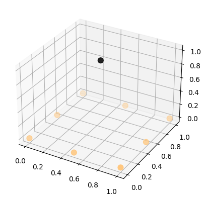
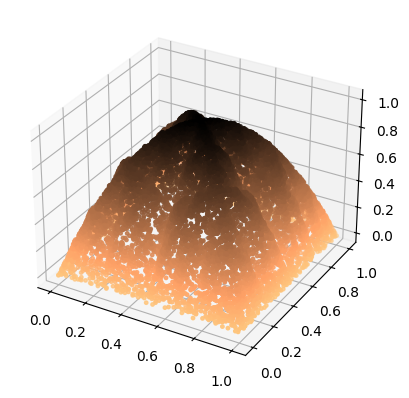
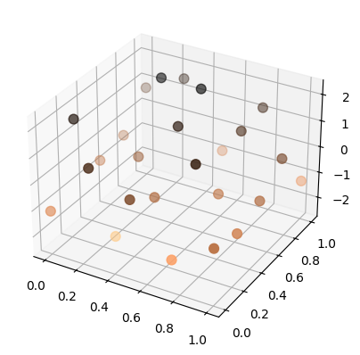
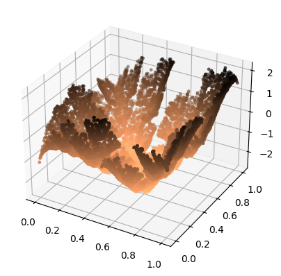
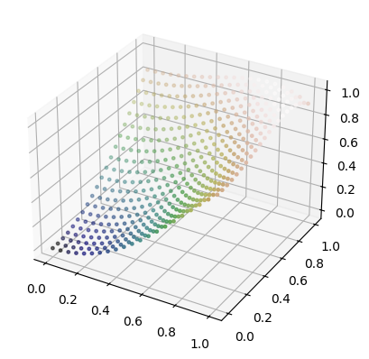
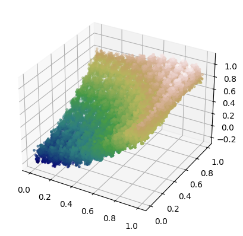

# Surface fractal interpolation

A jupyter notebook with implemnatation of fractal surface interpolation and brownian mothions in 3d.

## Interpolation
Based on initial points in 3d space creates continuous (as number of generated points tends to infinity) surface that interpolates the unknown one to which initial points belong.
Fractal interpolation is used which means that group of initial points is affinely transformed into many new groups each covering a part of original 2d domain but together covering the whole 2d domain of original initial points.

## Brownian motions
Brownian motion or Wiener's process is a stochastic process which satisfies 4 conditions:
1. $W_0=0$,
2. $\forall_{0 \leq t < s}\hspace{0.25cm}W_s - W_t \sim \mathbb{N} (0, s - t)$,
3. $\forall_{n \in \mathbb{N}}\hspace{0.25cm}\forall_{0 \leq t_1 < t_2 < t_3 < ... < t_{n-1} < t_n}\hspace{0.25cm}(W_{t_2} - W_{t_1}) {\perp\perp} (W_{t_3} - W_{t_2}) {\perp\perp} ... {\perp\perp} (W_{t_n} - W_{t_{n-1}})$,
4. $\forall_{\omega \in \Omega}\hspace{0.25cm}X_{\bullet}(\omega): T \to R$ is a continuous function.
In our project modified version, named fractional Brownian motion, is used to randomly generate surface in 3d.

## Usage
What are they for? Fractal interpolation, well like with regular ones, can be used to either recreate desired surface based on passes points (data recovery after compression) or to approximate the surface we are looking for.
While Brownian motion finds its uses in games for generating landscapes etc.

## Examples
||
|:--:| 
| *Initial points* |

||
|:--:| 
| *Interpolated surface* |

||
|:--:| 
| *Initial points* |

||
|:--:| 
| *Interpolated surface* |

||
|:--:| 
| *Initial points* |

||
|:--:| 
| *Interpolated surface* |

### Credits
Developed by Piotr Kosakowski and Michał Legczylin.
